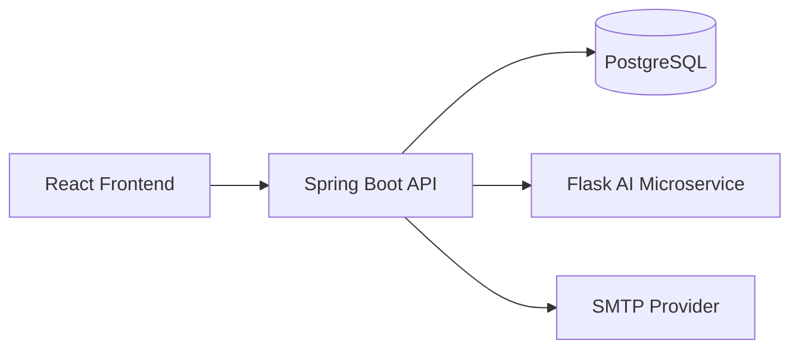

# 01 - System Architecture

## 1. Architectural Style

The application follows a layered monolith architecture with domain-oriented packaging. This gives the team modular boundaries without introducing distributed-system complexity.

### Layers

- API Layer: Spring REST controllers receive and validate HTTP input.
- Application Layer: Services orchestrate use cases and enforce business rules.
- Domain/Persistence Layer: JPA entities and repositories provide state management.
- Integration Layer: Clients for external systems (Flask AI service and SMTP provider).
- Cross-Cutting Layer: Security, configuration, and centralized exception handling.

## 2. Package-by-Domain Organization

Primary package root:

- com.peciatech.alomediabackend

Domain modules:

- ai: AI audio request handling and proxy logic.
- project: project aggregate lifecycle and sharing.
- project.history: auditable event timeline for project actions.
- notification: in-app and email notification side effects.
- report: admin analytics/report generation.
- auth/user/security/config/common.exception: platform capabilities and shared infrastructure.

This structure keeps business capabilities isolated and helps reduce coupling between unrelated features.

## 3. Runtime Topology

## 4. Request Processing Pipeline

1. Request enters Spring Security filter chain.
2. JWT filter resolves user context for protected routes.
3. Controller maps payload/params to DTOs.
4. Service applies domain rules and orchestration.
5. Repository persists/fetches from PostgreSQL.
6. Optional side effects trigger notifications/history/events.
7. Global exception handler normalizes any thrown error.
8. Controller returns JSON or binary response.

## 5. Security Boundaries

- Most routes require authentication.
- AI routes are explicitly protected.
- Admin report route is role-gated with method-level authorization.
- CORS is controlled by a single configured allowed origin.

## 6. Data Consistency and Transactions

Transactional boundaries are mainly at service layer methods that mutate state.

- Read-only transactions are used for query-heavy operations.
- Write operations in project and sharing services ensure repository writes are committed as a unit.
- Notification side effects in share flow are synchronous from service perspective.

## 7. Key Architectural Strengths

- Clear separation of concerns.
- Extensible pattern use (factory/observer/command) for evolving requirements.
- Centralized error shaping for predictable frontend behavior.
- Explicit integration points for AI and email services.

## 8. Trade-offs and Future Evolution

- Current architecture is optimized for velocity and maintainability in a single deployable unit.
- If event volume and background work increase, notification and history recording can be migrated to async/event-driven infrastructure.
- API contracts should eventually be formalized with OpenAPI to prevent drift.
