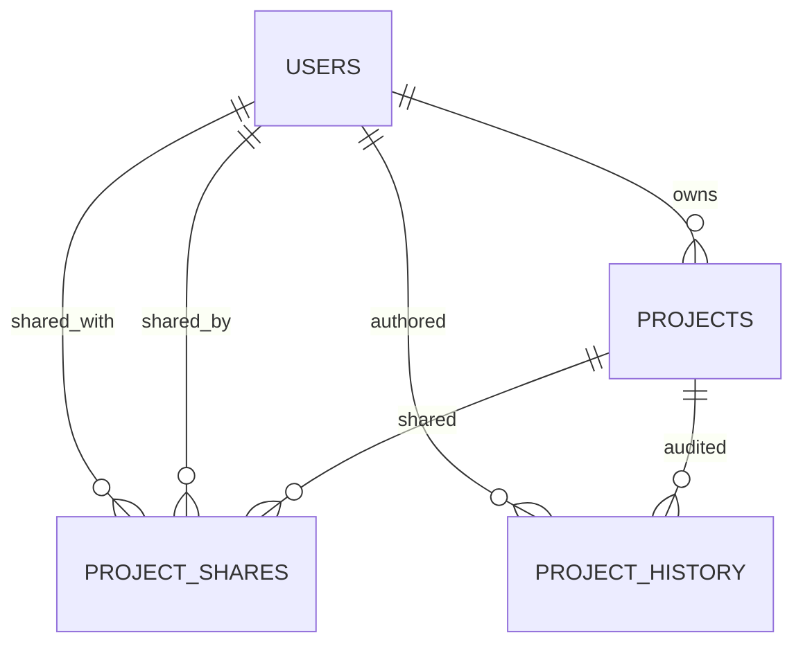

# 03 - Domain Entities

## 1. Data Model Overview

The domain model centers on collaborative media projects, with supporting history and notification records.

## 2. User Entity

Table: `users`

### Key fields

- id: primary key
- firstName: required
- lastName: required
- email: required, unique
- password: required
- role: enum-based authorization role
- enabled: account state
- provider: source of identity (`local`, `google`, `github`)

### Security integration

User implements `UserDetails`, allowing direct use by Spring Security for authorities and principal identity.

## 3. Project Entity

Table: `projects`

### Key fields

- id: primary key
- name: required
- status: enum (`DRAFT`, `SHARED`, `ARCHIVED`)
- timelineData: large text payload containing editor timeline state
- createdAt/updatedAt: automatic timestamps
- owner: many-to-one relationship to user

### Domain behavior notes

- Timeline data is stored as text, enabling flexible schema evolution from frontend editor versions.
- Ownership is enforced in service-level access checks.

## 4. ProjectShare Entity

Table: `project_shares`

### Key fields

- id
- project (many-to-one)
- sharedBy (many-to-one User)
- sharedWith (many-to-one User)
- sharedAt timestamp

### Constraint

Unique `(project_id, shared_with_id)` prevents duplicate sharing rows.

### Business meaning

This entity records access delegation from owner to collaborator.

## 5. ProjectHistory Entity

Table: `project_history`

### Key fields

- id
- projectId
- eventType (`CREATE`, `EDIT`, `EXPORT`, `SHARE`)
- timelineSnapshot (optional text)
- authorUserId
- createdAt

### Use case

Provides an immutable sequence of key actions for project-level audit and analytics.

## 6. Notification Entity

Table: `notifications`

### Key fields

- id
- recipientEmail
- type (e.g., `PROJECT_SHARED`)
- message
- read (default false)
- projectId
- createdAt

### Use case

Stores in-app notification records independently of email delivery success.

## 7. Enum Catalog

### ProjectStatus

- DRAFT
- SHARED
- ARCHIVED

### EventType

- CREATE
- EDIT
- EXPORT
- SHARE

## 8. Entity-Level Design Considerations

- Denormalized email in notifications simplifies recipient lookup.
- History references project/user by IDs rather than direct JPA relation for lightweight append operations.
- Timeline payload in text form enables compatibility with changing frontend timeline schema.
