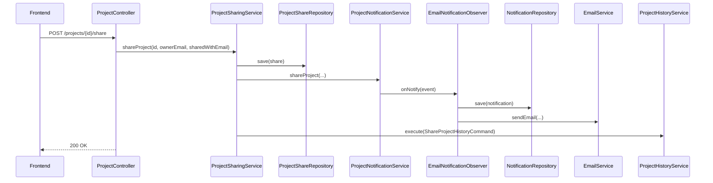
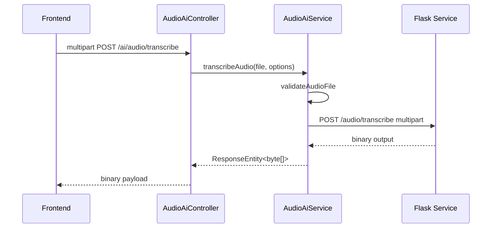

# 04 - Service Layer and Business Flows

## 1. Service Overview

The service layer is the orchestration core. Controllers remain thin while services enforce rules, call repositories, and trigger side effects.

Core services:

- ProjectService
- ProjectSharingService
- ProjectHistoryService
- NotificationService
- ProjectNotificationService
- ReportService
- AudioAiService

## 2. ProjectService

### Responsibilities

- Create project for authenticated owner.
- Read project with owner-only access check.
- List owned projects with pagination.
- Update project fields (name, timeline, status).
- Delete owned project.
- Record CREATE/EDIT history events.

### Rule Highlights

- User must exist in users table.
- Access is ownership-based.
- Non-owned project access maps to not found/forbidden behavior depending on context.

## 3. ProjectSharingService

### Responsibilities

- Share a project with another user by email.
- List projects shared with current user.
- Trigger notifications and history after successful share.

### Rule Highlights

- Owner cannot share with self.
- Only owner can share.
- Duplicate share is prevented.

### Side effects

- Persist ProjectShare row.
- Dispatch observer notification event.
- Record SHARE history command.

## 4. ProjectHistoryService

### Responsibilities

- Execute history commands (append events).
- Return history timeline for project owner.

### Rule Highlights

- History retrieval is owner-restricted.

## 5. Notification Services

### NotificationService

- Query all notifications for recipient.
- Query unread notifications.
- Mark single notification as read with recipient authorization check.

### ProjectNotificationService + EmailNotificationObserver

- Emits `PROJECT_SHARED` event.
- Observer stores notification row.
- Observer sends email through EmailService.

## 6. ReportService

### Responsibilities

- Aggregate platform counters:
  - users
  - projects
  - history event totals by type
- Select formatter factory by requested output format.

### Output modes

- JSON full data
- CSV row format
- SUMMARY compact map

## 7. AudioAiService

### Responsibilities

- Validate audio file extension, MIME type, and max size.
- Build multipart request and forward to Flask.
- Return binary payload and status from Flask.
- Map integration failures to domain-specific exceptions.

### Validation gates

- File required and non-empty.
- Max 50 MB.
- Allowed extensions: wav, mp3, ogg, flac, m4a.
- Allowed MIME types include standard audio MIME values configured in code.

## 8. End-to-End Flow: Share Project

## 9. End-to-End Flow: AI Transcription

## 10. Error Handling Strategy

- Services throw explicit business/integration exceptions.
- GlobalExceptionHandler maps all known exceptions to consistent ErrorResponse payload.
- Validation errors include field-level details for frontend forms.
